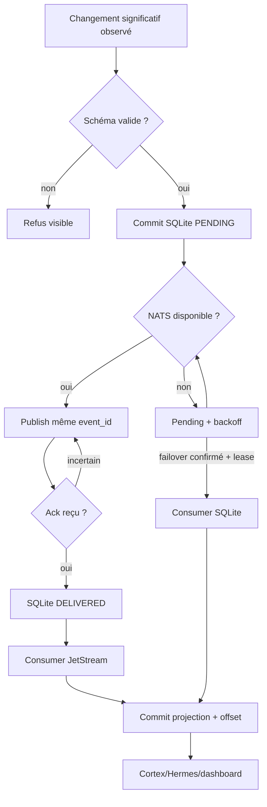

# Flux d'ingestion et failover

```mermaid
flowchart TD
    A[Changement significatif observé] --> B{Schéma valide ?}
    B -- non --> R[Refus visible]
    B -- oui --> S[Commit SQLite PENDING]
    S --> N{NATS disponible ?}
    N -- oui --> P[Publish même event_id]
    P --> K{Ack reçu ?}
    K -- oui --> D[SQLite DELIVERED]
    K -- incertain --> P
    N -- non --> W[Pending + backoff]
    W --> N
    D --> C[Consumer JetStream]
    W -->|failover confirmé + lease| L[Consumer SQLite]
    C --> X[Commit projection + offset]
    L --> X
    X --> H[Cortex/Hermes/dashboard]
```

Le replay reconstruit une projection ; il ne déclenche jamais un sink ou un ordre.
