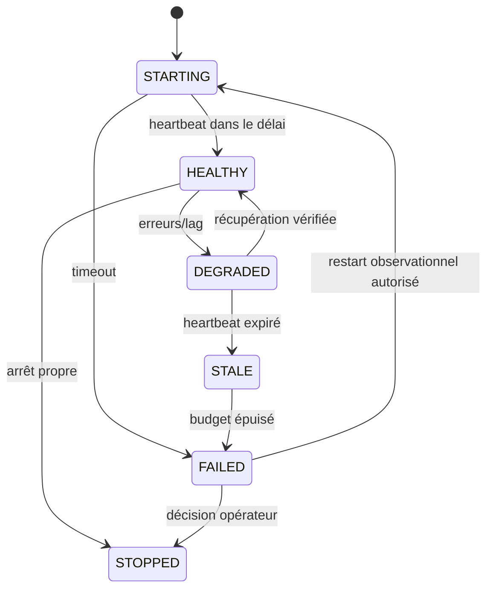

# Flux de supervision F0

```mermaid
stateDiagram-v2
    [*] --> STARTING
    STARTING --> HEALTHY: heartbeat dans le délai
    STARTING --> FAILED: timeout
    HEALTHY --> DEGRADED: erreurs/lag
    DEGRADED --> HEALTHY: récupération vérifiée
    DEGRADED --> STALE: heartbeat expiré
    STALE --> FAILED: budget épuisé
    FAILED --> STARTING: restart observationnel autorisé
    HEALTHY --> STOPPED: arrêt propre
    FAILED --> STOPPED: décision opérateur
```

Les composants trading/exécution/risque sont monitor-only : la transition FAILED
ne provoque aucun restart automatique.
