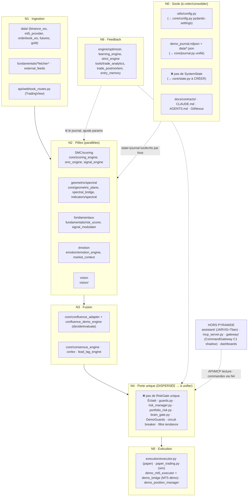

# TITANIUM_V12_INDEX — Hub global (Phase 0 réorg, 27/07/2026)

Carte de l'architecture **actuelle** projetée sur la pyramide cible. Aucun code modifié
en Phase 0 (lecture seule). Détail des findings + plan de migration : `REORG_AUDIT.md`.

## Diagramme — état actuel projeté sur la cible

## Correspondance modules → niveaux cible

| Niveau cible | Dossiers/fichiers actuels | Action réorg |
|---|---|---|
| **N0 socle** | `utils/config.py`, `docs/contracts/`, `CLAUDE.md`, `AGENTS.md`, journaux épars | **CRÉER** `core/state.py` (SystemState), `core/journal.py`, `core/config.py` |
| **N1 ingestion** | `data/` (WS, MT5, orderbook, futures, gold), `fundamentals/*fetcher*`, `api/webhook_routes.py` | Regrouper sous `ingestion/{market,news,whales,webhooks}` |
| **N2 pôles** | `core/{scoring,smc,signal}_engine`, `core/{geometric_plane,spectral_bridge}`+`indicators/spectral`, `fundamentals/`, `emotion/`, `vision/` | Regrouper sous `poles/{smc,spectral,fundamentals,emotion,vision}` |
| **N3 fusion** | `core/confluence_adapter`, `confluence_demo_engine`, `consensus_engine`, `cortex`, `lead_lag_engine` | Regrouper sous `fusion/` |
| **N4 porte** | `execution/guards.py`, `risk_manager.py`, `core/portfolio_risk.py`, `core/brain_gate.py`, DemoGuards, circuit breaker | **UNIFIER** dans `risk/riskgate.py` (Phase 1b) |
| **N5 exécution** | `execution/executor.py`, `paper_trading.py`, `demo_mt5_executor.py`, `demo_bridge.py`, `demo_position_manager.py` | `execution/` + `ExecutionPort` (MT5/Sim/Binance adaptateurs) |
| **N6 feedback** | `engine/{optimizer,learning_engine,strict_engine}`, `tools/{trade_analytics,trade_postmortem,entry_memory}` | Regrouper sous `feedback/` |
| **Transversal** | `api/` (FastAPI, dashboards, routes) | reste `api/` |
| **Hors pyramide** | `assistant/` (JARVIS+Titan), `mcp_server.py`, `gateway/` (CommandGateway) | JARVIS → dépôt séparé (Phase 3) |

## Documents clés
- `CLAUDE.md` — instructions + architecture détaillée (source de vérité actuelle).
- `collab/ETAT_ACTUEL.md`, `collab/LOG.md` — état multi-agents.
- `docs/ARCHITECTURE.md`, `docs/contracts/` — flux + registres gelés (EventPlane/CommandGateway).
- `REORG_AUDIT.md` — findings Phase 0 + plan de migration + risques.
- `REORG_STATE.md` — état de reprise du chantier (à créer au lancement Phase 1).
