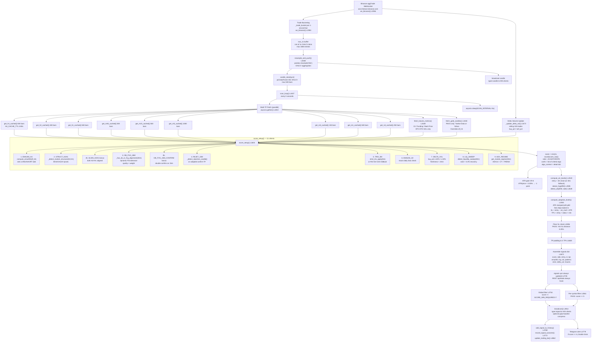

# Titanium Dashboard v10 — Signal Flow Analysis

## 1. Pipeline Overview

The pipeline transforms raw Binance WebSocket trade events into actionable trading signals emitted to connected browser clients. The flow is entirely asynchronous (Python asyncio) and runs continuously. At its core:

1. **Ingestion**: Every aggTrade event from Binance is received on a multiplexed WebSocket, bucketed into 1-second OHLCV bars, and simultaneously used to update a rolling delta-volume counter.
2. **Resampling**: On every new 1s bar, the raw buffer is resampled into 30-second OHLCV candles (the "chart feed") stored in `candle_store`.
3. **Multi-timeframe fetch**: Every 5 seconds `scan_loop` fetches or reads from TTL caches all 9 timeframes (1m through 1D) for each symbol.
4. **Scoring**: `score_setup()` evaluates 11 weighted criteria spanning all timeframes and returns an integer score `/11`, a direction string, the list of triggered confirmations, and a rich context dictionary.
5. **Level computation**: `compute_adaptive_levels()` derives ATR-based SL and 3-4 TP levels calibrated per-symbol.
6. **Emission**: If the score meets the minimum threshold, the assembled signal dict is broadcast to all subscribed WebSocket clients via `broadcast()`.

All stages are running concurrently; the scan loop fires the scoring engine every `SCAN_INTERVAL` seconds (default 5 s), completely independently of the WebSocket tick rate.

---

## 2. Stage-by-Stage Breakdown

### Stage 1 — Raw Data Ingestion
**Function**: `ws_binance()` — line 2936
**Input**: Binance combined stream `wss://stream.binance.com/stream?streams=btcusdt@aggTrade&ethusdt@aggTrade&…`
**Output**: `raw_1s[sym]` (list of 1s OHLCV dicts, capped at `MAX_1S = 1800` entries), `_delta_vol[sym]` updated in-place

**What happens**:
- Connects to a combined aggTrade stream for all symbols simultaneously.
- Three failover endpoints in `WS_BASES` are tried in sequence on any disconnect.
- Each aggTrade message carries: `price (p)`, `qty (q)`, `event time (T)`, `is_buyer_maker (m)`.
- **OHLCV bucketing**: incoming trades are accumulated into `_trade_bucket[sym]` keyed by `int(T_ms // 1000)`. When the second boundary changes, the completed 1s bar is appended to `raw_1s[sym]`. Gaps of 2–30 s are filled with flat bars at the prior close (gap > 30 s is ignored to avoid stale fills).
- **Delta volume** (`_update_delta_vol()`, line 3473): simultaneously, each trade is pushed into a `deque(maxlen=100)`. Buy/sell volumes are summed; `bullish = buy_pct >= 60%`, `bearish = sell_pct >= 60%`.
- After each completed bar, `resample_and_push(sym)` is called (with a per-symbol lock to prevent concurrent execution).

**Blocking conditions**:
- Symbol not in `SYMBOLS`.
- Event type is not `aggTrade`.
- `len(raw_1s[sym]) < 30` — resampling deferred until enough data.

---

### Stage 2 — Resampling to 30-Second Candles
**Function**: `resample_and_push()` — line 3048
**Input**: `raw_1s[sym]` — list of `{ts, open, high, low, close, v}` dicts
**Output**: `candle_store[sym]` — `pd.DataFrame` indexed by UTC `DatetimeIndex`, columns `[open, high, low, close, v]`, capped at `MAX_CANDLES_30S = 500` rows (~4h10m)

**What happens**:
- `raw_1s` is converted to a DataFrame, indexed on `ts`, and resampled at `30s` with standard OHLCV aggregation (first/max/min/last/sum).
- Empty periods drop via `dropna()`.
- The resulting DataFrame is stored as `candle_store[sym]`.
- The last completed candle is immediately broadcast to all clients as `{"type": "candle", …}`.
- `_last_bar_ts[sym]` is updated to the timestamp of the final bar.

**Blocking conditions**:
- `len(raw_1s[sym]) < 30` — exits early, no candle emitted.

---

### Stage 3 — Multi-Timeframe Klines Fetch
**Functions**: `_get_cached()` (line 3144) wrapping `fetch_klines()` (line 3078), called via per-TF wrappers `get_h4_cached()` … `get_1d_cached()` (lines 3155–3163). For PAXG: `fetch_gold_candles()` (line 3430).
**Input**: symbol + interval; `_CACHE_REGISTRY` TTL table
**Output**: 9 DataFrames: `df_h4, df_h2, df_h1, df_m30, df_m15, df_1m, df_5m, df_3m, df_1d` — all indexed by UTC `DatetimeIndex`, columns `[open, high, low, close, v]`

**Cache configuration** (interval: TTL seconds, max rows):

| Interval | TTL   | Max rows | History depth   |
|----------|-------|----------|-----------------|
| 1d       | 3600s | 250      | ~1 year         |
| 4h       | 240s  | 500      | ~83 days        |
| 2h       | 240s  | 400      | ~33 days        |
| 1h       | 120s  | 500      | ~20 days        |
| 30m      | 90s   | 500      | ~10 days        |
| 15m      | 60s   | 500      | ~5 days         |
| 5m       | 60s   | 1000     | ~3.5 days       |
| 3m       | 20s   | 150      | ~7.5 hours      |
| 1m       | 30s   | 500      | ~8 hours        |

**REST fallback**: `fetch_klines()` tries `api.binance.com` first, then `data-api.binance.vision`.

**PAXG/Gold override** (line 4484): after the standard H4 fetch, if `GOLD_REAL_ENABLED=1` and the symbol is in `GOLD_SYMBOL_MAP`, `fetch_gold_candles()` is called for XAU/USD. It tries Twelve Data first (if `TWELVEDATA_API_KEY` is set), then falls back to Yahoo Finance `GC=F`. On success, `df_h4` is **replaced** by the gold data and `h4_store[sym]` is overwritten. The 30m and lower TFs remain PAXG/USDT data from Binance.

**Futures data** (line 4474): for BTC/ETH/SOL, `fetch_futures_metrics()` is called (cached 60 s) to retrieve OI, OI change %, funding rate, mark price, and long/short ratio from `fapi.binance.com`. This data is passed to `score_setup` but does not affect the numerical score.

---

### Stage 4 — Indicator Computation (inside score_setup and helpers)
All indicator computation happens inside or called from `score_setup()` (line 1604).

**Key helper functions and their roles**:

| Function | Line | Purpose |
|----------|------|---------|
| `compute_ema200()` | 1310 | EMA(200) on a price series |
| `_detect_market_structure()` | 1317 | BOS/CHoCH detection via swing pivots on N bars; returns BULLISH/BEARISH/RANGING |
| `_has_ob_or_fvg_alignment()` | 1516 | Checks if current price is inside/near an OB or FVG; uses dynamic Fib tolerance |
| `_compute_fib_tolerance()` | 1435 | Derives tolerance from Fibonacci 0.618–0.786 zone of last swing |
| `_ob_status()` | 1465 | Classifies each OB as intact / tested / broken |
| `_detect_rejection_candle()` | 1398 | Detects pin bar, engulfing, or strong momentum candle |
| `_detect_range_30m()` | 1497 | Range detection: ATR_current < 30% of ATR_mean on 20-bar window |
| `strict_trix_apply()` | 3525 | Applies STRICT TRIX indicator (triple EMA ROC) with trend MA and entry/exit signals |
| `TitaniumOptimizerV8.detect_liquidity_sweep()` | 625 | Detects stop-hunt pattern (wick below historical low + recovery) |
| `TitaniumOptimizerV8.get_market_regime()` | 670 | Computes ADX14; returns TREND / RANGE / UNKNOWN |

**Indicator inputs per timeframe**:

| Indicator | Primary TF | Fallback TF |
|-----------|-----------|-------------|
| EMA200 trend bias | H4 | — |
| BOS structure | H2 + H1 | — |
| OB/FVG proximity | 30m | 30s (candle_store) |
| OB/FVG double confirm | 15m | — |
| Rejection candle | adapted per `active_tf` | 15m → 30m → 30s |
| TRIX / RSI entry | 5m | RSI fallback (5m + 10m resample) |
| EMA200 macro bias | 1D | — |
| Delta volume | rolling 100 aggTrades | — |
| Liquidity sweep | 30m (≥55 bars) | 30s |
| ADX regime | 30m | 30s |

---

### Stage 5 — 11-Point Scoring
**Function**: `score_setup()` — line 1604
**Signature**: `(df_h4, df_1m, df30, df_h2, df_h1, df_m30, df_m15, df_m5, strict_params, scoring_w, rsi_long_override, rsi_short_override, df_1d, delta_vol_state, futures_data, active_tf) → (score: int, side: str, confs: List[str], algo_context: dict)`

**Early exit**:
- Returns `(0, "N/A", [], {})` if `len(df_h4) < 5`.

**ATR gate** (V9-8): if `ATR_30m / price < 0.0005` (< 0.05%), `score_raw -= 1.0` and `ATR_TOO_LOW` is appended to `confs`.

**Scoring criteria (weighted)**:

| # | Key | Condition for +1 | TF |
|---|-----|-------------------|----|
| 1 | `EMA200_H4` | Always awarded; sets `side` direction. H4 close > EMA200 = LONG | H4 |
| 2 | `STRUCT_H2H1` | H2 or H1 structure (BOS/CHoCH) aligned with side | H2, H1 |
| 2b | `ALIGN_H2H1` | **Bonus**: both H2 AND H1 structure aligned | H2, H1 |
| 3 | `OB_FVG_30M` | Price within OB or FVG zone on 30m (dynamic Fib tolerance); quality-weighted (intact=1.0, tested=0.65, fvg=0.85) | 30m (fallback 30s) |
| 3b | `OB_FVG_15M_CONFIRM` | **Bonus**: OB/FVG also confirmed on 15m | 15m |
| 4 | `REJET_15M` | Rejection candle (pin bar / engulfing / strong body) on confirmation TF | TF per `active_tf` (see table) |
| 5 | `TRIX_5M` | STRICT TRIX `entry_long` + in-trend, OR RSI 5m+10m ≤ 28/≥ 72 (fallback) | 5m |
| 6 | `EMA200_1D` | Daily close > EMA200(1D) for LONG (or below for SHORT) | 1D |
| 7 | `DELTA_VOL` | `delta_pct ≥ 60%` buy (LONG) or ≤ 40% (SHORT); data freshness < 2 min | aggTrade rolling |
| 8 | `LIQ_SWEEP` | Stop-hunt pattern detected: wick beyond historical extreme + recovery 0.3% | 30m (fallback 30s) |
| 9 | `ADX_REGIME` | ADX14 > 27 (TREND) with OB/FVG ok, OR ADX ≤ 27 (RANGE) with OB status intact/tested | 30m |

**Final score**: `score = min(11, int(round(score_raw)))`. Each criterion's raw contribution is multiplied by its adaptive weight from `scoring_weights[sym]` (range 0.5–2.0, initial 1.0).

**Confirmation TF table** (driven by `active_tf` env var, default `5m`):

| active_tf | Confirmation TF | OB lookback 30m | OB lookback 15m |
|-----------|----------------|-----------------|-----------------|
| 1m | 5m (df_m5 direct) | 30 bars | 20 bars |
| 3m | 15m (df_m15 direct) | 40 bars | 25 bars |
| 5m | 45m (df_m5 resampled) | 50 bars | 30 bars |
| 15m | 1h (df_m5 resampled) | 60 bars | 40 bars |
| 30m | 2h (df_m5 resampled) | 80 bars | 50 bars |
| 1h | 4h (df_h4 direct) | 100 bars | 60 bars |
| 4h | 1D (df_1d direct) | 120 bars | 80 bars |

---

### Stage 6 — SL/TP Level Computation

**Step A — Entry price** (`compute_atr_levels()`, line 2519):
- Entry = last close on 3m candles if `df_3m` available with ≥ 1 bar; else last close on 30s candles.
- Initial SL = 60-bar swing low − 0.35 × ATR14 (LONG) or swing high + 0.35 × ATR14 (SHORT).
- TPs initially set to real OB resistance/support levels; filled with ATR multiples (1×, 2×, 3×, 4× risk) as needed.
- **Sanity check** (line 4536): if entry / current_close > 2.0 or < 0.5, the 3m cache is purged and entry falls back to last 30s close.

**Step B — Adaptive SL/TP** (`compute_adaptive_levels()`, line 2463):
- **Input**: entry price, ATR14 value (from 3m or 30s), side string, last-50-bar lookback DF.
- ATR is clamped between the 20th and 80th percentile of a rolling-30 ATR mean from `lookback_df`.
- Fees (4 bps by default) are baked into the adjusted entry price before SL/TP calculation.
- `SL = adj_entry − atr_mult × clamped_ATR` (LONG), or `+ atr_mult × ATR` (SHORT).
- TPs = `adj_entry + ratio × risk` for each ratio in `tp_ratios` (default 1.2, 1.8, 2.4).
- **Output**: `(sl: float, tps: List[float])` — 4 decimal places.

**Step C — Floor SL** (line 4596, PAXG only):
- If `sl_floor_pct > 0` (0.25% for PAXG), and `|entry − sl| < entry × 0.0025`, SL is pushed out to the floor distance, and TPs are recalculated accordingly.

**Step D — TP padding** (line 4608):
- Pads list to exactly 4 TPs if fewer were generated, using incremental ATR multiples.

**Per-symbol override parameters**:

| Symbol | atr_mult | tp_ratios | rsi_long | rsi_short | score_min | sl_floor_pct |
|--------|----------|-----------|----------|-----------|-----------|--------------|
| Default | 1.0 | 1.2, 1.8, 2.4 | 28 | 72 | 0 (global 7) | — |
| PAXG/USDT | 1.2 | 1.0, 1.5, 2.0 | 35 | 65 | 5 | 0.25% |

---

### Stage 7 — Signal Assembly, Filtering, and Broadcast

**Where**: `scan_loop()` lines 4672–4869

**Signal dict** assembled at line 4672 (`sig`), contains: `symbol`, `score`, `score_max=11`, `side`, `confs`, `entry`, `sl`, `tps`, `tp1–tp4`, `fvg`, `ob`, `ob_context`, `candle_patterns`, `reversal_patterns`, `supertrend`, `volume_poc`, `ema200_h4`, `ema20`, `strict`, `strict_entry_ts`, `delta_vol`, `futures`, `liq_sweep_ok`, `adx_regime`, `struct_h2`, `struct_h1`, `struct_1d`, `d1_bias_ok`, `active_tf`, `ts` (ISO UTC), `best_config_2025`, and the last 300 candles as a list.

**Stored unconditionally**: `signals[sym] = sig` (line 4735) — always written so the REST `/api/state` endpoint stays current regardless of emission.

**Emission filter** (line 4754):
- Global gate: `score >= SCORE_MIN_REQUIRED` (default 7/11). Signal broadcast is **suppressed** if score is below this threshold.
- Per-symbol gate (`_below_min`, line 4561): for PAXG/USDT, `score >= 5` is required. If below, the WS emission is skipped **and** the previous signal's entry/SL/TP levels are preserved in `signals[sym]` to avoid stale UI levels.

**Broadcast** (`broadcast()`, line 4914):
- Sends `{"type": "signal", "symbol": sym, "data": sig}` to all connected WebSocket clients for that symbol.
- If `WS_COMPRESS=gzip_base64` and payload ≥ 25 KB, it is gzip-compressed and base64-encoded before sending.
- Dead (disconnected) clients are pruned from `ws_clients[sym]` on each broadcast.
- Additionally, on every iteration, a `{"type": "candle", …}` frame is broadcast from `resample_and_push()` independently of the score.

**Side effects after emission**:
- `add_signal_to_history()` (line 4769): logged if `score >= 4` and not `_below_min`.
- `record_signal_outcome()` (line 4772): marks any pending historical signals as tp/sl hit.
- `update_trailing_be()` (line 4862): moves SL to break-even if TP1 was reached.
- Telegram alert (line 4779): sent if `score >= TELEGRAM_SCORE_THRESHOLD` (default 6) with anti-spam throttle of 5 minutes per symbol.

---

## 3. Mermaid Flowchart



---

## 4. Data Structures

### raw_1s[sym]
```python
# List of dicts, max 1800 entries
[
    {
        "ts":    pd.Timestamp (UTC),   # second boundary
        "open":  float,
        "high":  float,
        "low":   float,
        "close": float,
        "v":     float,                # volume
    },
    ...
]
```

### candle_store[sym]
```python
# pd.DataFrame, DatetimeIndex UTC, max 500 rows
# columns: open, high, low, close, v (float64)
# frequency: 30s bars
```

### _delta_vol[sym]
```python
{
    "buy_vol":   float,   # sum of buy qty in rolling window
    "sell_vol":  float,
    "delta":     float,   # buy_vol - sell_vol
    "delta_pct": float,   # buy_vol / total (0.0–1.0)
    "bullish":   bool,    # delta_pct >= 0.60
    "bearish":   bool,    # delta_pct <= 0.40
    "trades":    deque(maxlen=100),  # (qty, is_buy) tuples
    "ts":        float,   # unix timestamp of last update
}
```

### score_setup return tuple
```python
(
    score:        int,          # 0–11
    side:         str,          # "ACHAT [LONG]" | "VENTE [SHORT]"
    confs:        List[str],    # e.g. ["EMA200(H4)", "STRUCT(H2)", "OB/FVG(30m)[intact]", ...]
    algo_context: Dict[str, Any]  # detailed per-criterion metrics (see below)
)
```

### algo_context dict (key fields)
```python
{
    "h4_close":       float,
    "ema200_h4":      float,
    "struct_h2":      str,       # BULLISH | BEARISH | RANGING
    "struct_h1":      str,
    "align_h2_h1":    bool,
    "ob_fvg_ok":      bool,
    "ob_status_30m":  str,       # intact | tested | broken | fvg | none
    "ob_quality_30m": float,     # 0.0–1.0
    "ob_fvg_15m_ok":  bool,
    "ob_quality_15m": float,
    "rejection_ok":   bool,
    "entry_signal":   bool,
    "rsi_5m":         float | None,
    "ema200_1d":      float | None,
    "d1_bias_ok":     bool,
    "struct_1d":      str,
    "delta_vol_ok":   bool,
    "delta_vol_pct":  float,
    "delta_vol_signal": str,     # BULLISH | BEARISH | NEUTRAL
    "liq_sweep_ok":   bool,
    "adx_regime":     str,       # TREND | RANGE | UNKNOWN
    "adx_regime_bonus": bool,
    "futures": {
        "oi": float, "oi_change_pct": float,
        "funding": float, "mark_price": float,
        "long_short_ratio": float | None,
    } | None,
}
```

### signals[sym] (assembled signal dict, broadcast payload)
```python
{
    "symbol":         str,
    "score":          int,          # 0–11
    "score_max":      11,
    "side":           str,
    "confs":          List[str],
    "entry":          float,
    "sl":             float,
    "tps":            List[float],  # 4 elements
    "tp1"–"tp4":      float | None,
    "be":             float,        # break-even = entry
    "be_active":      bool,
    "ema200_h4":      float,
    "ema20":          List[{"time": int, "value": float}],
    "fvg":            List[{"top", "bot", "ts", "type", "width_pct"}],
    "ob":             List[{"top", "bot", "ts", "type", "status"}],
    "ob_context":     dict,
    "candle_patterns": List[dict],
    "reversal_patterns": List[dict],
    "volume_poc":     float | None,
    "supertrend":     dict | None,
    "strict":         dict | None,
    "strict_entry_ts": List[int],
    "delta_vol":      dict | None,
    "futures":        dict | None,
    "liq_sweep_ok":   bool,
    "adx_regime":     str,
    "struct_h2", "struct_h1", "struct_1d": str,
    "d1_bias_ok":     bool,
    "active_tf":      str,
    "best_config_2025": dict,
    "ts":             str,          # ISO UTC timestamp
    "candles":        List[{"time": int, "open", "high", "low", "close": float}],
                      # last 300 × 30s bars
}
```

### signal_history[sym] (persistence)
```python
[
    {
        "ts", "ts_open":  str,    # ISO UTC open time
        "ts_close":       str | None,
        "score":          int,
        "side":           str,
        "confs":          List[str],
        "entry", "sl", "tp1"–"tp4": float | None,
        "exit_price":     float | None,
        "outcome":        str,    # pending | tp1_hit | tp2_hit | tp3_hit | tp4_hit | sl_hit
        "outcome_ts":     str | None,
        "pnl":            float | None,   # normalized (exit - entry) / entry
    },
    ...  # max 500 per symbol
]
```

---

## 5. Filtering Conditions (What Can Block a Signal)

### At Stage 1 (ingestion)
- Symbol unknown (not in `SYMBOLS`).
- Non-aggTrade events discarded.
- `raw_1s` buffer < 30 entries: `resample_and_push` returns early; `candle_store` not updated.

### At Stage 2 (resampling)
- If pandas resample produces all-NaN rows, they are dropped via `dropna()`.

### At Stage 3 (TF fetch)
- Binance REST returns non-200 status: `fetch_klines` tries the fallback endpoint, then returns an empty DataFrame. Downstream scoring uses empty DataFrame checks.
- For PAXG: if both Twelve Data and Yahoo Finance fail, `df_h4` remains the Binance PAXG/USDT data.

### At Stage 4–5 (scoring)
- `len(df_h4) < 5`: returns `(0, "N/A", [], {})` immediately.
- ATR gate (V9-8): `ATR_30m / price < 0.0005` deducts 1 point.
- Per-criterion checks: each criterion has a minimum data requirement (typically 5–20 bars on its TF). If data is insufficient, the criterion is simply not awarded rather than blocking.
- TRIX criterion: requires `strict_params` populated by `strict_recalib_loop` (runs every 2 days); if not yet calibrated, falls back to RSI 5m+10m.
- Delta volume freshness: `ts` must be within 120 s of now, else criterion not awarded.

### At Stage 7 (emission)
- `score < SCORE_MIN_REQUIRED` (default 7): signal update written to `signals[sym]`, but **WebSocket broadcast suppressed**.
- `_below_min` (PAXG `score < 5`): same — no WS broadcast, previous SL/TP levels preserved.
- `candle_store[sym]` has < `MIN_DF30_FOR_SCAN` (3) rows: the entire `scan_loop` iteration is skipped for that symbol.
- No WebSocket clients connected: `broadcast()` returns immediately without serializing the payload.
- Telegram: suppressed if `score < TELEGRAM_SCORE_THRESHOLD` (default 6), or if the last alert for this symbol was < 5 minutes ago.

---

## 6. Per-Symbol Specifics — PAXG/Gold Differences

### Data Source Override (H4 only)
- `GOLD_SYMBOL_MAP["PAXG/USDT"] = "XAU/USD"`.
- When `GOLD_REAL_ENABLED=1`, `fetch_gold_candles()` replaces `df_h4` with real XAU/USD data.
- Provider priority: Twelve Data (`TWELVEDATA_API_KEY` required) → Yahoo Finance `GC=F` → fallback to Binance PAXG/USDT.
- Cache TTL: 180 s (vs 240 s for standard H4).
- All lower timeframes (30m, 15m, 5m, 3m, 1m) remain Binance PAXG/USDT data.
- **Implication for scoring**: criterion 1 (EMA200_H4) and the BOS structure checks on H4 use the real gold price, so the trend direction reflects XAU/USD, not PAXG. Criteria 3 onward (OB/FVG, rejection, TRIX) use PAXG Binance candles.

### Futures Data
- PAXG/USDT is **not** in `FUTURES_SYMBOLS_MAP` — no OI/funding data is fetched or shown in `algo_context["futures"]`.

### RSI Thresholds
- Default: `RSI_ENTRY_LONG=28`, `RSI_ENTRY_SHORT=72`.
- PAXG override: `rsi_long=35`, `rsi_short=65` — gold reacts earlier to overbought/oversold conditions.

### SL/TP Parameters
- `atr_mult=1.2` (vs default 1.0) — slightly wider SL for the asset's lower relative volatility.
- `tp_ratios=(1.0, 1.5, 2.0)` — more conservative than the default `(1.2, 1.8, 2.4)`.
- `sl_floor_pct=0.0025` — minimum SL distance of 0.25% of price (e.g., at $2,500/oz = minimum $6.25 SL).

### Score Minimum
- PAXG requires only `score >= 5` for emission (vs global `SCORE_MIN_REQUIRED=7`).
- This reflects the lower absolute volatility and mean-reverting nature of gold, which makes the standard 7/11 threshold too restrictive.

### Optimization Configurations
- `OPT_CONFIGURATIONS_PAXG` (12 configs, line 278) is a dedicated conservative set used by the `optimisation_loop` for PAXG, excluding aggressive ATR/TP ratios inappropriate for gold.

### Circuit Breaker Behavior
- `circuit_breaker_monitor()` calculates `max_drawdown` from `signal_history` PnL records and compares against `_best_results_2025[sym]["max_drawdown"]`. For PAXG the backtest config history may show a poor Sharpe (approximately −3.68), so the circuit breaker may fire more conservatively.
