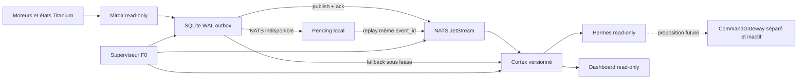

# Titanium v12 — EventPlane NATS/SQLite et supervision F0

**Date :** 2026-07-19

**Statut :** design approuvé par Florent, implémentation non encore approuvée

**Périmètre :** observabilité PAPER/DEMO uniquement
**Équipe :** Florent (autorité), Codex (design/red-team), Claude (revue/implémentation après plan), Hermes (consommateur read-only)

## 1. Autorité et précédence

Cette spécification reprend les invariants du contrat
`collab/CONTRAT_FUSION_HERMES_EVENTPLANE_COMMANDGATEWAY_2026-07-19.md`, mais
**supplante** ses décisions d'implémentation dès qu'elles divergent :

- NATS JetStream est le transport principal ;
- SQLite WAL est l'outbox transactionnelle et le secours local ;
- la supervision F0 fait partie du premier lot ;
- aucun CommandGateway actif, aucune capacité d'ordre et aucune route de mutation ;
- les modules déjà écrits `core/event_plane.py` et `core/event_mirror.py` sont des
  prototypes dormants jusqu'à revue GitNexus, tests de panne et plan approuvé ;
- aucun câblage dans `lifespan`, aucune route API et aucun flag actif avant les
  gates de cette spécification.

Le « passage en production » demandé par Florent signifie ici **production de
l'observabilité**. Il ne constitue pas une autorisation d'ordre réel, de nouvelle
logique de décision ou de délégation du déclenchement à Hermes/LLM.

## 2. Objectif et hors-périmètre

### Objectif

Construire un plan de faits durable qui :

1. reçoit des événements significatifs sans modifier les décisions des moteurs ;
2. les persiste localement avant publication ;
3. les distribue normalement par JetStream ;
4. continue localement si JetStream est indisponible ;
5. reconstruit un Cortex versionné pour Hermes et le dashboard ;
6. supervise les composants d'observation sans redémarrer automatiquement les
   composants capables d'émettre un ordre.

### Hors-périmètre

- CommandGateway actif ou capacité PAPER/DEMO ;
- modification des stratégies, scores, confluence, consensus, émotion ou risque ;
- modification des exécuteurs ou du mur DEMO/réel ;
- ordre réel (interdit ; compte réel PAPER ONLY) ;
- boutons d'activation/restart mutables ;
- ingestion de ticks bruts ;
- apprentissage capable de promouvoir une politique live.

## 3. Architecture approuvée



Le bus `utils/event_bus.py` reste un bus UI/télémétrie indépendant. Son `emit()` a
un impact GitNexus CRITICAL (11 amonts et 5 flux) : il n'est ni réécrit ni promu
comme plan de contrôle.

## 4. Composants

### 4.1 Miroir read-only

Le miroir observe les projections existantes et produit des faits après un
changement significatif. Il n'est pas importé par les moteurs et ne se trouve pas
sur leur chemin critique. Une panne du miroir produit une santé dégradée, jamais
une modification de décision.

Le premier palier lit Cortex et les états déjà exposés. Les producteurs in-engine
sont reportés à un lot séparé après analyse d'impact, car ils augmenteraient le
couplage et le risque de régression.

### 4.2 SQLite WAL outbox/secours

SQLite est obligatoire avant toute publication. Une transaction atomique valide,
alloue les séquences, insère l'événement et le place `PENDING`. Réglages minimaux :

- `journal_mode=WAL` ;
- `synchronous=FULL` ;
- `foreign_keys=ON` ;
- `busy_timeout` borné ;
- permissions Windows minimales ;
- aucun purge automatique des éléments pending, conflictuels ou en quarantaine.

### 4.3 Relay JetStream

Le relay sélectionne les événements `PENDING`, publie avec
`Nats-Msg-Id = event_id`, attend l'ack du serveur et marque ensuite l'événement
`DELIVERED` avec la séquence broker. Un ack incertain entraîne un retry avec le
même identifiant. Le relay ne génère jamais un nouvel identifiant métier.

La fenêtre de déduplication JetStream est une optimisation, pas la garantie
end-to-end : après une panne plus longue que cette fenêtre, le stream peut contenir
deux livraisons du même `event_id`. Chaque consommateur conserve donc un ledger
durable des `event_id` appliqués. La correction repose sur ce ledger et sur
l'idempotence de la projection, jamais uniquement sur la fenêtre NATS.

### 4.4 Cortex

Cortex est une projection, jamais une source autoritaire. Il consomme JetStream en
mode normal et SQLite en mode secours. Application de l'événement et progression
de l'offset sont atomiques et idempotentes. Un état stale, incomplet ou avec gap
reste visible comme `DEGRADED`, `STALE` ou `UNKNOWN`.

Chaque commit de projection présente le numéro d'époque courant comme jeton de
fencing. Un projecteur dont le lease a expiré ou dont l'époque est ancienne ne peut
plus committer, même s'il continue momentanément à s'exécuter.

### 4.5 Hermes et dashboard

Hermes reçoit :

- une projection humaine compacte ;
- les événements significatifs à la demande ;
- la fraîcheur, les versions, les gaps et la santé des sources.

Il ne reçoit pas de secret, tick brut ou primitive exécutable. Le dashboard expose
les mêmes faits et la santé, sans endpoint de mutation dans ce lot.

## 5. Enveloppe immuable

Chaque événement contient obligatoirement :

```json
{
  "schema_version": 1,
  "event_id": "uuid-v4",
  "event_type": "risk.guard.refused.v1",
  "occurred_at": "2026-07-19T08:00:00.000000Z",
  "recorded_at": "2026-07-19T08:00:00.010000Z",
  "stream_id": "risk.guard|instrument:BTCUSD",
  "stream_seq": 42,
  "global_offset": 1842,
  "source": {
    "component": "mirror.risk",
    "instance_id": "boot-uuid",
    "producer_version": "build-id"
  },
  "partition_key": "instrument:BTCUSD",
  "idempotency_key": "stable-business-key",
  "correlation_id": "trace-id-or-null",
  "causation_id": "event-id-or-null",
  "scope": "OBSERVE",
  "classification": "INTERNAL",
  "payload": {},
  "payload_sha256": "sha256",
  "prev_event_hash": "sha256-or-null",
  "event_hash": "sha256"
}
```

Contraintes :

- `event_type` est versionné et décrit un fait, jamais une instruction ;
- `scope` appartient à `OBSERVE | PAPER | DEMO` ;
- dates UTC timezone-aware ;
- JSON canonique, clés triées, `allow_nan=False` ;
- champs réservés non surchargeables ;
- payload validé par le schéma exact du type ;
- payload canonique limité à 256 KiB et profondeur JSON bornée ;
- horloge future au-delà de la tolérance configurée : refus ou état `CLOCK_SKEW`,
  jamais fraîcheur implicite ;
- même `(source.component, idempotency_key)` et même contenu : receipt original ;
- même clé et contenu différent : `IDEMPOTENCY_CONFLICT` visible ;
- immutabilité après commit SQLite ;
- livraison au moins une fois, effets consommateurs idempotents ;
- payload sans secret, approval, URL de commande, handler, code ou token.

## 6. Types initiaux fermés

Le registre initial autorise uniquement :

- `runtime.task.heartbeat.v1` ;
- `runtime.task.state_changed.v1` ;
- `runtime.component.degraded.v1` ;
- `analysis.confluence.evaluated.v1` ;
- `analysis.consensus.updated.v1` ;
- `analysis.emotion.updated.v1` ;
- `analysis.leadlag.observed.v1` avec `m2_eligible=false` ;
- `trading.signal.observed.v1` ;
- `trading.position.opened.v1` (PAPER/DEMO factuel) ;
- `trading.position.closed.v1` (PAPER/DEMO factuel) ;
- `risk.guard.refused.v1` ;
- `risk.drawdown.threshold_crossed.v1` ;
- `eventplane.integrity.failed.v1` ;
- `eventplane.transport.state_changed.v1`.

Un type inconnu est refusé. Les événements de position constatent un effet déjà
survenu ; ils ne peuvent pas le provoquer.

## 7. Livraison, bascule et réconciliation

### Flux normal

1. validation du draft ;
2. commit SQLite `PENDING` ;
3. publication JetStream avec le même `event_id` ;
4. attente de l'ack ;
5. transition SQLite `DELIVERED` ;
6. consommation JetStream ;
7. commit projection + offset ;
8. ack consumer.

### Incidents

| Incident | Comportement obligatoire |
|---|---|
| NATS indisponible | conserver localement, retry exponentiel plafonné à 60 s |
| ack incertain | republier avec le même identifiant |
| SQLite indisponible | refuser la publication, santé CRITICAL, pas de bypass NATS |
| projecteur en erreur | ne pas avancer l'offset |
| événement poison | quarantaine visible, source conservée |
| gap/hash rompu | intégrité CRITICAL, replay automatique suspendu |

### Bascule

Une bascule exige une indisponibilité confirmée, un lease et un numéro d'époque.
Un seul projecteur est actif. Le fallback reprend au dernier `global_offset`.
Le lease, l'époque et le commit de projection sont contrôlés transactionnellement ;
un ancien propriétaire ne peut pas avancer l'offset après perte du lease.

### Retour vers JetStream

1. arrêter proprement le projecteur local ;
2. relayer les `PENDING` ;
3. attendre le rattrapage JetStream ;
4. vérifier offsets, séquences et hashes ;
5. démarrer une nouvelle époque JetStream ;
6. comparer le digest de projection avant de déclarer `HEALTHY`.

### Rétention

- JetStream : 30 jours ou 100 000 événements significatifs ;
- SQLite : pas de purge sans archive vérifiée et manifeste de hashes ;
- pending, conflits, quarantaine : jamais supprimés automatiquement.

## 8. Superviseur F0

Chaque tâche déclare : identité, propriétaire, criticité, singleton, heartbeat,
timeouts, politique de restart et budget d'échec.

États : `STARTING`, `HEALTHY`, `DEGRADED`, `STALE`, `FAILED`, `STOPPED`,
`UNKNOWN`. `UNKNOWN` n'est jamais vert.

Politique :

- auto-restart uniquement relay, projecteur et tâches d'observation ;
- maximum 3 tentatives sur 15 minutes, backoff plafonné à 60 s ;
- budget épuisé : `FAILED`, alerte et attente opérateur ;
- NATS reste un service externe monitoré ; F0 ne lance aucune commande système et
  ne manipule pas le service Windows dans ce lot ;
- trading, exécution et risque : monitor-only ;
- aucun clear de kill-switch ou circuit breaker ;
- un relay, un projecteur par époque, un exécuteur par compte/mode ;
- pas de bouton de mutation dans ce lot.

Santé exposée : âge heartbeat, lag, pending, plus ancien pending, intégrité, mode
`JETSTREAM | SQLITE_FALLBACK`, budget restart, dernière erreur expurgée, état de
synchronisation Cortex/Hermes.

F0 maintient aussi une santé locale hors EventPlane (snapshot atomique + logs
Windows/applicatifs), afin qu'une panne de l'EventPlane ne masque pas sa propre
défaillance et n'engendre pas une boucle récursive d'événements de santé.

## 9. Sécurité NATS

- bind `127.0.0.1` uniquement ;
- authentification obligatoire ;
- secrets hors dépôt et bus, fichiers protégés par ACL Windows ;
- version et checksum figés dans le plan d'implémentation ;
- monitoring/admin non exposé au réseau ;
- stockage JetStream dédié ;
- compte/service Windows minimal si installation comme service ;
- arrêt de NATS sans arrêt de Titanium.

## 10. Tests obligatoires

### Unitaires

- schémas, canonicalisation, dates, NaN/Inf, champs réservés ;
- idempotence exacte et conflit divergent ;
- séquences concurrentes, hashes et offsets monotones ;
- lease, époque, failure budget et transitions F0.

### Intégration

- commit SQLite avant ack ;
- publish/ack/dedup JetStream ;
- crash relay/projecteur ;
- ack perdu ;
- retry après expiration de la fenêtre de déduplication JetStream ;
- panne et redémarrage NATS ;
- SQLite lock, corruption et disque plein simulé ;
- doublons, désordre, gap et événement poison ;
- failover puis retour avec digest de projection identique.
- projecteur zombie refusé après changement de lease/époque.

### Non-régression/sécurité

- aucune dépendance EventPlane vers un sink ;
- aucune modification de position lors d'une panne EventPlane ;
- compte réel toujours PAPER ONLY ;
- mur DEMO/réel inchangé ;
- aucune fuite de secret ;
- tests existants ciblés verts ;
- `detect_changes` conforme au périmètre.

## 11. Déploiement de production observabilité

1. geler et auditer les prototypes existants ;
2. corriger B0 par TDD sans câblage ;
3. installer NATS isolé et vérifier version/checksum/ACL/persistance ;
4. tester le relay uniquement avec événements synthétiques ;
5. tester F0 et les pannes ;
6. activer le miroir read-only depuis Cortex, off par défaut ;
7. exposer la santé read-only au dashboard ;
8. connecter la perception Hermes read-only ;
9. soak test 24 h avec panne NATS provoquée ;
10. activer l'observabilité seulement si toutes les gates sont vertes.

Chaque modification de symbole runtime est précédée d'un impact GitNexus. Tout
résultat HIGH/CRITICAL est communiqué à Florent avant édition. Avant commit,
`detect_changes` doit confirmer que décisions, risque et exécution sont hors lot.

## 12. Rollback

- désactiver le miroir par configuration ;
- arrêter le relay et NATS sans arrêter Titanium ;
- conserver SQLite intact ;
- Cortex revient à sa lecture actuelle ;
- bus UI et moteurs restent inchangés ;
- aucun replay vers une logique d'ordre ;
- rapport d'incident avec dernier offset, époque et digest.

## 13. Gates d'acceptation

Le lot n'est « production observabilité » que si :

- tous les tests obligatoires passent ;
- zéro perte et zéro double effet logique pendant le soak test ;
- rollback testé ;
- aucune route de mutation et aucun CommandGateway actif ;
- aucun changement de décision/exécution/risque ;
- NATS écoute uniquement en local avec authentification ;
- F0 ne redémarre aucun composant capable d'émettre un ordre ;
- GitNexus impact/detect_changes sont satisfaisants ;
- Claude et Codex rendent un verdict GO ;
- Florent donne le go d'activation final après lecture des preuves.

## 14. Décisions approuvées par Florent

- Section 1 architecture/frontières : approuvée ;
- Section 2 enveloppe immuable : approuvée ;
- Section 3 failover/réconciliation : approuvée ;
- Section 4 supervision F0 : approuvée ;
- Section 5 sécurité/tests/production/rollback : approuvée ;
- choix final : NATS JetStream principal, SQLite WAL secours.
